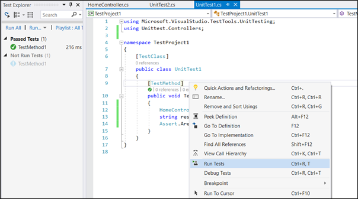
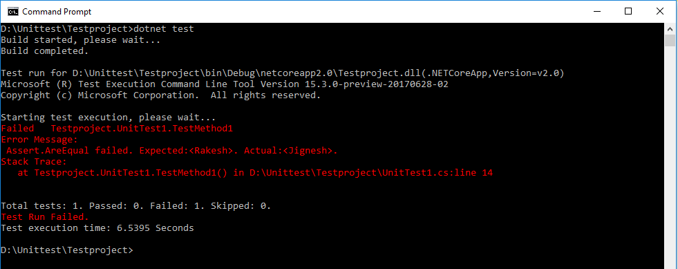

## Introduction
There are three different test frameworks are supported for unit test with asp.net core: MSTest, xUnit and NUnit that allow us to test our code in consistent way. In this article I will explain about the unit test in asp.net core using MSTest.

To demonstrate the example of unit test, I have created MVC project, solution and Unit test project by using CLI (Command Line Interface). To create MVC and Test project, I am following below steps

1) Create Solution file using following command. This command creates empty solution.
```
>dotnet new sln -n MVCUnittest 
```
2) Creating MVC Project: Using following command, MVC project will be created
```
>dotnet new MVC
```
3) Adding this project to solution: Using following command we can add project to solution
```
>dotnet sln add Unittest\Unittest.csproj
```
4) Create MsTest Project: Using following command, we can create MSTest project.
```
>dotnet new mstest
```
This command is create MSTest Project and generated template configures Test runner into .csproj file
```
<ItemGroup>
  <PackageReference Include="Microsoft.NET.Test.Sdk" Version="15.3.0" />
  <PackageReference Include="MSTest.TestAdapter" Version="1.1.18" />
  <PackageReference Include="MSTest.TestFramework" Version="1.1.18" />
</ItemGroup>
```
The generated code also has dummy unittest file. It looks as following

using Microsoft.VisualStudio.TestTools.UnitTesting;
```
namespace Testproject
{
    [TestClass]
    public class UnitTest1
    {
        [TestMethod]
        public void TestMethod1()
        {
            
        }
    }
}
```
The TestClass attribute denotes the class which contains unit tests and TestMethod attribute denoted a method is a test method. 

5) Adding test project to solution 
```
>dotnet sln add TestProject\Testproject.csproj
```
To demonstrate concept, I have created method within HomeController class (GetEmployeeName). This method accepts empId as parameter and based on this, it will return name of employee or "Not Found" hard code string.

HomeController
```
public string GetEmployeeName(int empId)
{
    string name;
    if (empId == 1)
    {
        name = "Jignesh";
    }
    else if (empId == 2)
    {
        name = "Rakesh";
    }
    else
    {
        name = "Not Found";
    }
    return name;
}
```
In the following test method, I have pass hardcoded value and check result using Assert class. 

Unittest1.cs
```
using Microsoft.VisualStudio.TestTools.UnitTesting;
using Unittest.Controllers;

namespace TestProject1
{
    [TestClass]
    public class UnitTest1
    {
        [TestMethod]
        public void TestMethod1()
        {
            HomeController home = new HomeController();
            string result = home.GetEmployeeName(1);
            Assert.AreEqual(result, "Jignesh");
        }
    }
}
```

Final step is to run the Unit test. Using following command, we can run our all test cases.
```
>dotnet test
```
Result


We also run all test cases or individual test within visual studio using Test Explore.
 

In the preceding example, my test result (actual) is match with expected result. In following example, my actual result is not match with expected result.
```
[TestMethod]
public void TestMethod2()
{
    HomeController home = new HomeController();
    string result = home.GetEmployeeName(2);
    Assert.AreEqual(result, "Jignesh");
}
```
Result
 

To unit test every block of code, we require more test data. We can add more test method using TestMethod attribute, but it is very tedious job. The MSTest project is also support other attribute which enable us to write a suite for similar test. A DataTestMethod attributes represent a suite of tests which execute the same code with different input arguments. A DataRow attribute can be used for specifying the values for those inputs. Instead of creating new test, we can use these two attributes: DataTestMethod and DataRow to create a single data driven test.  
```
using Microsoft.VisualStudio.TestTools.UnitTesting;
using Unittest.Controllers;

namespace TestProject1
{
    [TestClass]
    public class UnitTest2
    {
        [DataTestMethod]
        [DataRow(1, "Jignesh")]
        [DataRow(2, "Rakesh")]
        [DataRow(3, "Not Found")]
        public void TestMethod1(int empId, string name)
        {
            HomeController home = new HomeController();
            string result = home.GetEmployeeName(empId);
            Assert.AreEqual(result, name);
        }
    }
}
```
Result
 

### Unit test with ILogger 
The .net core support built-in dependency injection. So whatever the services, we want to use during the execution of the code are injected as dependency. One of the best example is ILogger service. Using following code, we can configure ILogger service in our asp.net core project.

Configure ILogger in Program.cs
```
using Microsoft.AspNetCore;
using Microsoft.AspNetCore.Hosting;
using Microsoft.Extensions.Logging;

namespace Unittest
{
    public class Program
    {
        public static void Main(string[] args)
        {
            BuildWebHost(args).Run();
        }

        public static IWebHost BuildWebHost(string[] args) =>
            WebHost.CreateDefaultBuilder(args)
                .ConfigureLogging((hostingContext, logging) =>
                {
                    logging.AddConfiguration(hostingContext.Configuration.GetSection("Logging"));
                    logging.AddConsole();
                    logging.AddDebug();
                })
                .UseStartup<Startup>()
                .Build();
    }
}
```

TestController
```
using Microsoft.AspNetCore.Mvc;
using Microsoft.Extensions.Logging;

namespace Unittest.Controllers
{
    public class TestController : Controller
    {
        private readonly ILogger _logger;
        public TestController(ILogger<TestController> logger)
        {
            _logger = logger;
        }
        
        public string GetMessage()
        {
           _logger.LogDebug("Index Method Called!!!");
            return "Hi! Reader";
        }
    }
}
```
### Unit Test Method
To unit test controller having dependency on ILogger service, we have to pass ILogger object or null value to constructor. To create these type dependencies, we can create object of service provider and help of the service provide, we can create the object of such services. 

In the following code, I have created service provider object and create ILogger object.
```
[TestMethod]
public void TestMethod4()
{
    var serviceProvider = new ServiceCollection()
        .AddLogging()
        .BuildServiceProvider();

    var factory = serviceProvider.GetService<ILoggerFactory>();

    var logger = factory.CreateLogger<TestController>();
    TestController home = new TestController(logger);
    string result = home.GetMessage();
    Assert.AreEqual(result, "Hi! Reader");
}
```

### Summary
Unit test is a code that helps us in verifying the expected behavior of the other code in isolation. Here “In isolation" means there is no dependency between the tests. This is a better idea to test the Application code, before it goes for quality assurance (QA). 
