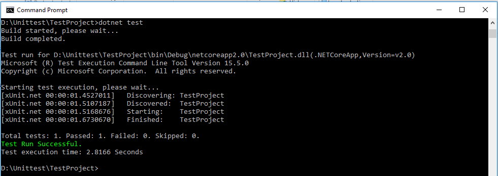
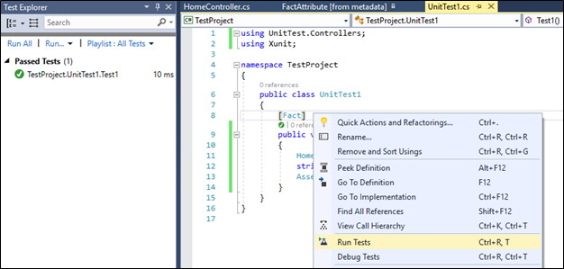
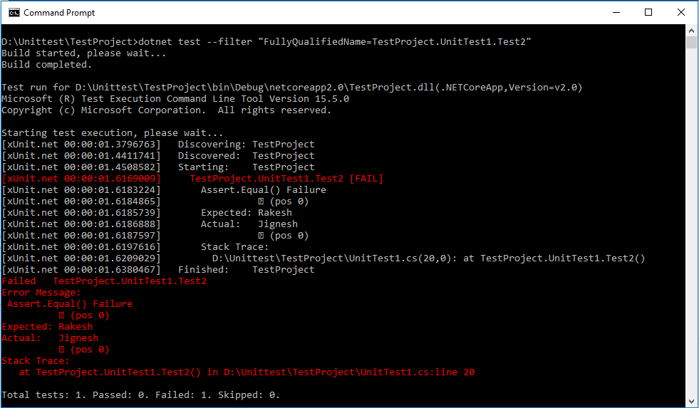
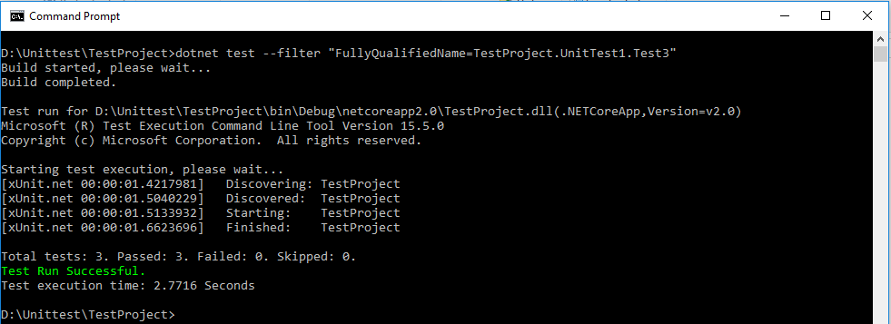

## Introduction
There are three different test frameworks are supported for unit test with asp.net core: MSTest, xUnit and NUnit that allow us to test our code in consistent way. In this article, I will explain about the unit test in asp.net core using xUnit.
the XUnit is an open souce test framework and main focus of this framework are extensibility and flexibility. It follows more community focus to being expand.

To demonstrate the example of unit test, I have created MVC project, solution and Unit test project by using CLI (Command Line Interface). To create MVC and Test project, I am following below steps

1) Create Solution file using following command. This command creates empty solution.
```
>dotnet new sln -n MVCUnittest 
```
2) Creating MVC Project: Using following command, MVC project will be created
```
>dotnet new MVC
```
3) Adding this project to solution: Using following command we can add project to solution
```
>dotnet sln add Unittest\Unittest.csproj
```
4) Create XUnit test project: Using following command, we can create XUnit test project.
```
>dotnet new xUnit
```
This command creates XUnit Test Project and generated template configures Test runner into .csproj file
```
<ItemGroup>
  <PackageReference Include="Microsoft.NET.Test.Sdk" Version="15.5.0" />
  <PackageReference Include="xunit" Version="2.3.1" />
  <PackageReference Include="xunit.runner.visualstudio" Version="2.3.1" />
  <DotNetCliToolReference Include="dotnet-xunit" Version="2.3.1" />
</ItemGroup>
```
The generated code also has dummy unit test file. It looks as following
```
using Xunit;

namespace TestProject
{
    public class UnitTest1
    {
        [Fact]
        public void Test1()
        {

        }
    }
}
```
As compare to MsTest, XUnit has Fact attribute that is applied to a method to indicate that it is a fact that should be run by the test runner. 

5) Adding test project to solution 
```
>dotnet sln add TestProject\Testproject.csproj
```
To demonstrate concept, I have created method within HomeController class (GetEmployeeName). This method accepts empId as parameter and based on this, it will return name of employee or "Not Found" hard code string.

HomeController
```
public string GetEmployeeName(int empId)
{
    string name;
    if (empId == 1)
    {
        name = "Jignesh";
    }
    else if (empId == 2)
    {
        name = "Rakesh";
    }
    else
    {
        name = "Not Found";
    }
    return name;
}
```

In the following test method, I have pass hardcoded value and check result using Assert class. 

Unittest1.cs
```
using UnitTest.Controllers;
using Xunit;

namespace TestProject
{
    public class UnitTest1
    {
        [Fact]
        public void Test1()
        {
            HomeController home = new HomeController();
            string result = home.GetEmployeeName(1);
            Assert.Equal("Jignesh", result);
        }
    }
}
```
Final step is to run the Unit test. Using following command, we can run our all test cases.
```
>dotnet test
>dotnet test --filter "FullyQualifiedName=TestProject.UnitTest1.Test1"
```
Result



We also run all test cases or individual test within visual studio using Test Explore.


In the preceding example, my test result (actual) is match with expected result. In following example, my actual result is not match with expected result.
```
[Fact]
public void Test2()
{
    HomeController home = new HomeController();
    string result = home.GetEmployeeName(1);
    Assert.Equal("Rakesh", result);
}
```
Result


To unit test every block of code, we require more test data. We can add more test method using Fact attribute, but it is very tedious job. The XUnit is also support other attribute which enable us to write a suite for similar test. A Theory attribute can be applied to the test that can take test data directly using InlineData attribute or excel spread sheet.  Instead of creating new test, we can use these two attributes: Theory and InlineData to create a single data driven test.  

```
using UnitTest.Controllers;
using Xunit;

namespace TestProject1
{
    public class UnitTest1
    {
        [Theory]
        [InlineData(1, "Jignesh")]
        [InlineData(2, "Rakesh")]
        [InlineData(3, "Not Found")]
        public void Test3(int empId, string name)
        {
            HomeController home = new HomeController();
            string result = home.GetEmployeeName(empId);
            Assert.Equal(name, result);
        }
    }
}
```

Result


Unit test with ILogger 
The .net core support built-in dependency injection. So, whatever the services, we want to use during the execution of the code are injected as dependency. One of the best example is ILogger service. Using following code, we can configure ILogger service in our asp.net core project.

Configure ILogger in Program.cs
```
using Microsoft.AspNetCore;
using Microsoft.AspNetCore.Hosting;
using Microsoft.Extensions.Logging;

namespace Unittest
{
    public class Program
    {
        public static void Main(string[] args)
        {
            BuildWebHost(args).Run();
        }

        public static IWebHost BuildWebHost(string[] args) =>
            WebHost.CreateDefaultBuilder(args)
                .ConfigureLogging((hostingContext, logging) =>
                {
                    logging.AddConfiguration(hostingContext.Configuration.GetSection("Logging"));
                    logging.AddConsole();
                    logging.AddDebug();
                })
                .UseStartup<Startup>()
                .Build();
    }
}
```

TestController
```
using Microsoft.AspNetCore.Mvc;
using Microsoft.Extensions.Logging;

namespace Unittest.Controllers
{
    public class TestController : Controller
    {
        private readonly ILogger _logger;
        public TestController(ILogger<TestController> logger)
        {
            _logger = logger;
        }
        
        public string GetMessage()
        {
           _logger.LogDebug("Test Method Called!!!");
            return "Hi! Reader";
        }
    }
}
```
### Unit Test Method
To unit test controller having dependency on ILogger service, we have to pass ILogger object or null value to constructor. To create these type dependencies, we can create object of service provider and help of the service provide, we can create the object of such services. 

In the following code, I have created service provider object and create ILogger object.
```
[Fact]
public void Test4()
{
    var serviceProvider = new ServiceCollection()
        .AddLogging()
        .BuildServiceProvider();

    var factory = serviceProvider.GetService<ILoggerFactory>();

    var logger = factory.CreateLogger<TestController>();
    TestController home = new TestController(logger);
    string result = home.GetMessage();
    Assert.Equal("Hi! Reader", result);
}
```

### Summary
Unit test is a code that helps us in verifying the expected behavior of the other code in isolation. Here “In isolation" means there is no dependency between the tests. This is a better idea to test the Application code, before it goes for quality assurance (QA). All Unit test frameworks, MSTest, XUnit and NUnit, offer a similar end goal and help us to write unit test simpler, easier and faster.


https://raygun.com/blog/unit-testing-frameworks-c/
http://asp.net-hacker.rocks/2017/03/31/unit-testing-with-dotnetcore.html
http://binary-notes.ru/choosing-of-the-unit-testing-framework/
https://stackoverflow.com/questions/38063903/vs-2013-mstest-vs-nunit-vs-xunit
https://cmatskas.com/unit-testing-with-net-core/